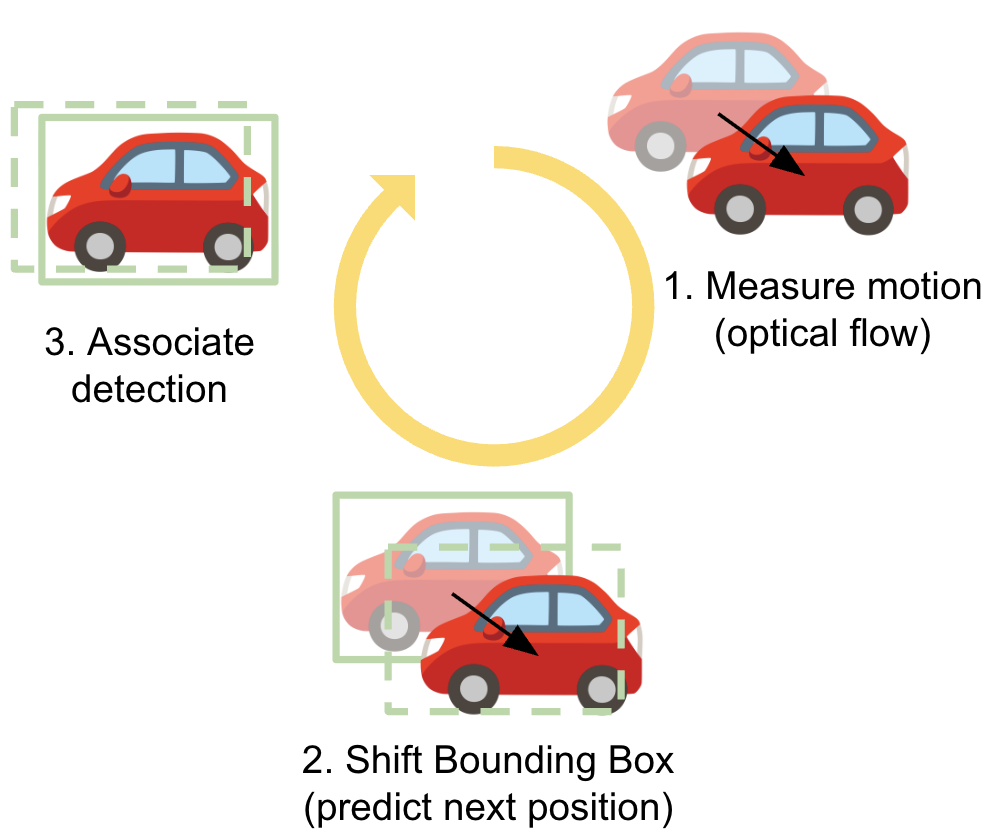

# Week 3: Tracking with optical flow

## Introduction

In the third week of the project, we integrate optical flow to last week's tracking. The goal is still to detect vehicles in road traffic sequences and maintain their identities across time.

This week is divided into two main blocks:

1. **Optical flow integration**: Evaluating optical flow methods and integrate their results into the tracking algorithm from the previous week.

2. **Evaluation on S01 and S03**: Evaluating the same method as in the previous block but in 2 different datasets (S01 and S03).

## Dataset

For Optical Flow, we evaluate on the KITTI dataset from 2012, especifically ```image_0/000045_(10|11).png.```.

Then, for testing the integration we work with the AI City Challenge sequence **S03-C010**, provided for the project.

Finally, for evaluating on the other datasets we use the complete sequences S01 and S03 from the AI City Challenge, focusing on single camera tracking.

## Tasks Overview

The work for Week 3 is structured according to the project tasks:
 
**Task 1: Optical Flow integration**
- **Task 1.1: Optical Flow:**  
  Evaluate different methods on the pair of images especified rom the KITTI dataset.

- **Task 1.2: Integrate Optical Flow:**  
  Adapt last week's algorithm to use optical flow to help with the final result. This is evaluated in the same dataset as last week's.

**Task 2: Evaluation on S01 and S03**
- **Task 2.1: S01:**  
  Evaluate the developed method on sequence S01 from the AI City Challenge dataset. This does not include multi-camera tracking.

- **Task 2.2: S03:**  
  Same as Task 2.1 but with sequence S03.


## Repository Structure

The Week3 directory is organized as follows:

```
Week3/
├── src/
│   ├── main.py         # Entry point of Week 3
│   ├── utils/          # Shared helper functions used across tasks
│   ├── task1/          # Code for Task 1
│   └── task2/          # Code for Task 2
├── config/             # Config files 
├── environment.yml     # Environment yaml
└── README.md           # README for Week 3
```

## Installation
To run the code in this repo you must first install all needed libraries using conda with the help of the ```environment.yml``` file. This code is tested under python version 3.12.

```bash
cd Week2
conda env create -f environment.yml
conda activate c6
```

### Submodules installation
```bash
git submodule init # If no .gitmodules file is present
git submodule update # This will clone the 'pyflow' and TrackEval repos as submodules inside the submodules folder

# Build Pyflow into the environment
cd submodule/pyflow
pip install --no-build-isolation . # If using conda or python's virtual environments
```

If there are some missing dependencies, refer to their respective GitHub repos to see more detailed installation instructions. [Pyflow's repo](https://github.com/pathak22/pyflow.git) [TrackEval's repo](https://github.com/JonathonLuiten/TrackEval.git).

## How to run

The project can be executed in two different ways:  
(1) using a configuration file, or  
(2) directly from the command line.

---

### Option 1: Using a Configuration File (Recommended for Parameter Search)

You can define all parameters in a YAML configuration file and run:

```bash
python -m src.main --config config/taskX.yaml
```

### Option 2: Direct Command Line Execution

You can also run a single configuration directly from the terminal:

```bash
python -m src.main taskX \
  --video_path path/to/video.avi \
  --gt_xml_path path/to/annotations.xml
``` 
Hyperparameters can also be passed manually. 

For more information on each parameter run:
```bash
# General parameters
python -m src.main -h
# Task specific parameters
python -m src.main taskX -h
```

> **Note:** Task **2.2 (S03)** does not have a standalone command. It uses the same code as task 2.1.

## Task 1.1
We kept the Faster R-CNN model from last week and tested Pyflow, Farneback, Perceiver IO and MEMFOF. We ended up keeping MEMFOF as the final model for the other tasks.

## Task 1.2 - Optical Flow Tracker

In this task we extend the tracking-by-detection approach from the previous week by incorporating optical flow to estimate object motion between frames. Instead of relying on a predefined motion model (e.g., Kalman filtering), the tracker directly estimates displacement from pixel-level motion.

<p align="center">
  
</p>

The method follows a tracking-by-motion pipeline composed of the following steps:

### 1. Track Initialization

In the first frame, all detected objects are assigned a unique track ID. Each track stores the current bounding box and its associated identity.

### 2. Motion Estimation with Optical Flow

For each tracked object, dense optical flow is computed between consecutive frames `t-1 -> t`
The flow vectors inside each bounding box are aggregated to estimate the dominant motion of the object. In our implementation we compute the median flow vector within the bounding box, which provides a robust estimate of the object displacement.

This motion vector is used to predict the new position of the bounding box in the next frame.

### 3. Detection Association

The predicted bounding boxes are matched with the detections in the current frame using IoU-based matching.
The detection with the highest overlap with the predicted position inherits the same track ID, allowing the tracker to maintain consistent object identities over time.

### 4. Temporal Recovery

If a detection is temporarily missing, the tracker attempts to recover the track using past positions.
The algorithm searches several previous frames for a compatible bounding box (based on IoU). If a match is found, the track is recovered and the missing detections are interpolated; otherwise a new track is initialized.

### 5. Iterative Tracking

This process is repeated for every new frame: optical flow is used to estimate motion, bounding boxes are shifted according to the predicted displacement, and detections are associated to maintain consistent identities.

### Implementation Details

Optical flow is computed using MEMFOF, which provided the best trade-off between accuracy and computational efficiency during our preliminary evaluation. By estimating motion directly from image displacement, this approach allows the tracker to adapt to complex motion patterns without assuming a fixed motion model.

More details on the hyperparameters and evaluation metrics used can be found in last week's README.md.


## Task 2.1 and Task 2.2
More details on the evaluation metrics used can be found in last week's README.md.
